# 资源推动 Agent Demo

资源调查 Demo：规则提取与确定性降级、`MiniMax-M3` Chat Completions + Pydantic 结构化输出、intake 阶段受控的 Tavily 关键人身份补全、MCP 内部实体与项目查询、关联分析和 Jinja2 报告。

业务操作、历史会话和管理后台说明见 [资源推动 Agent 使用手册](docs/资源推动Agent使用手册.md)。

## 启动

1. 在 `.env` 中填写 `TAVILY_API_KEY`、`OPENAI_API_KEY` 和自行生成的随机 `LLM_SAFETY_SALT`。模型网关为 `https://vftllmapi.vf-tech.cn`，主模型与复核模型均为 `MiniMax-M3`，推理强度为 `xhigh`。
2. 执行：

```powershell
docker compose up --build
```

3. 打开 `http://localhost:3000`。

首次启动只下载本地 Whisper 模型。内部项目向量由 HashingVectorizer 即时生成，不下载嵌入模型。页面固定支持最新版桌面端 Chrome。

当前共有 9 个结构化 LLM 提示词节点：5 个 intake 节点、3 个研究节点和 1 个分析问答节点。未配置 `OPENAI_API_KEY`、模型请求超时、输出格式错误或网关不可用时，对应路径会记录降级事件，并在可降级的节点继续使用规则、Tavily、MCP 和 Jinja2 生成结果。

固定文本测试：

```text
老板周五要和比亚迪股份有限公司的王传福董事长兼总裁吃饭，主要聊新能源和储能项目。
```

歧义确认测试：

```text
华星的李总明天参加会议
```

## 自动测试

```powershell
python -m venv .venv
.\.venv\Scripts\python -m pip install -r backend\requirements-test.txt
.\.venv\Scripts\python -m pytest backend\tests -q
cd frontend
npm install
npm run build
```

## 服务

- Web：`http://localhost:3000`
- API：`http://localhost:8000`
- API 文档：`http://localhost:8000/docs`
- MCP：`http://localhost:8001/mcp`

## 架构与流程

以下内容以当前 `main` 分支代码为准。当前未实现 Authentication、Nginx/API Gateway、独立 Report API、对象存储和集中可观测性；报告直接作为任务响应字段返回。

当前 LLM 节点按职责分为：

- Intake：`intake_chat`、`intake_followup`、`intake_identity_normalize`、`intake_readiness`、`intake_final_confirmation`
- Research：`evidence_verify`、`final_synthesis`
- Analysis chat：`analysis_chat`

### 图 1：系统总览

这张图只展示运行时主干，细节在后续小图中展开。

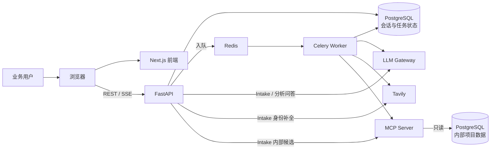

前端页面由 Next.js 提供；浏览器使用 `NEXT_PUBLIC_API_BASE_URL` 直接访问 FastAPI。FastAPI 负责会话、任务和事件读取，并同步执行 Intake 与分析问答；耗时的音频转写与研究流程由 Celery Worker 执行。

### 图 2：用户业务流程

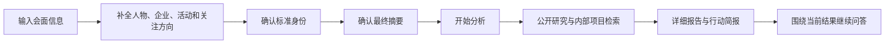

身份不完整时流程留在 intake 阶段继续追问或让用户选择候选。只有最终摘要确认后，`POST /api/v1/intake/{session_id}/start-analysis` 才会创建研究任务。

### 图 3：信息采集

#### 图 3.1：文字采集与身份补全

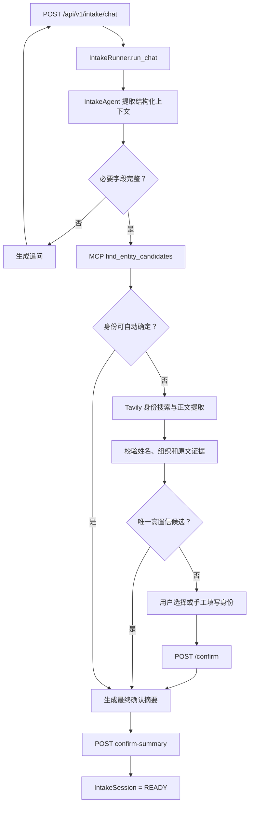

内部实体查询始终先执行；Web 查询只补全仍未解决的身份。外部候选只有在来源页面正文能够支持标准姓名和关系信息时才会被接受。

#### 图 3.2：音频采集

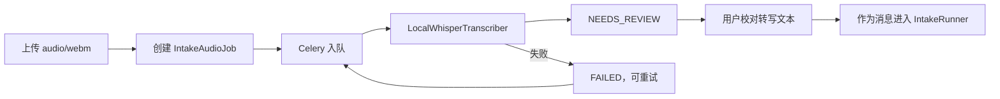

录音文件写入 `audio_data` 命名卷。前端轮询音频任务，转写成功后必须由用户确认文本，不能直接触发研究。

### 图 4：后端模块

#### 图 4.1：API 与状态读取

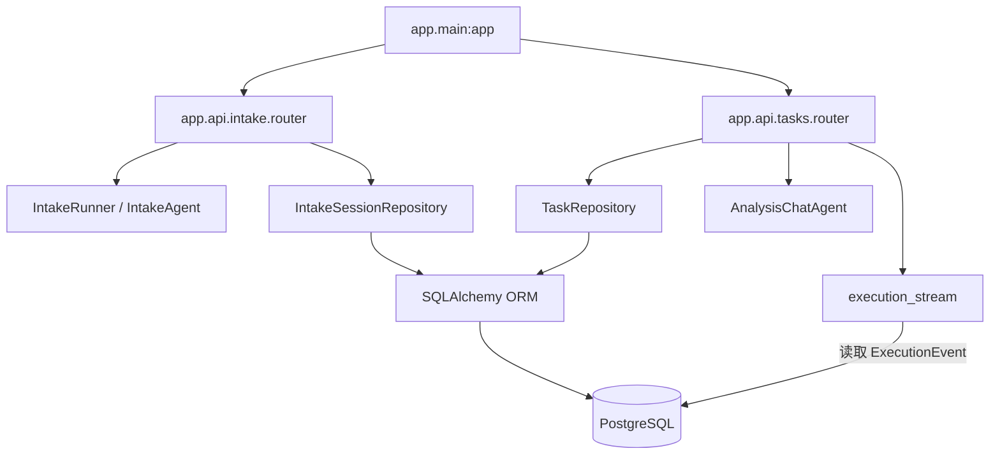

Intake Router 提供对话、活动查询、音频上传/重试、身份确认、摘要确认和开始分析；Task Router 提供兼容的文字/音频任务入口，以及任务查询、执行日志、SSE、确认、取消、清空和分析问答。`GET /api/v1/tasks/{task_id}` 同时返回任务状态和报告字段，当前没有独立 Report Router。`GET /api/v1/tasks/{task_id}/events` 从 `execution_events` 读取事件并输出 SSE；前端另外轮询 intake activity 和音频任务状态。

#### 图 4.2：异步任务与研究服务

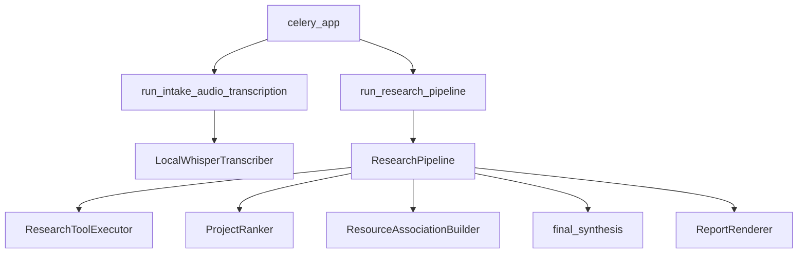

`ResearchPipeline` 按固定顺序调用公开检索、内部项目查询、排序、关联、综合和渲染；工具参数仍由规则代码生成。

### 图 5：研究流水线

#### 图 5.1：任务启动与上下文准备

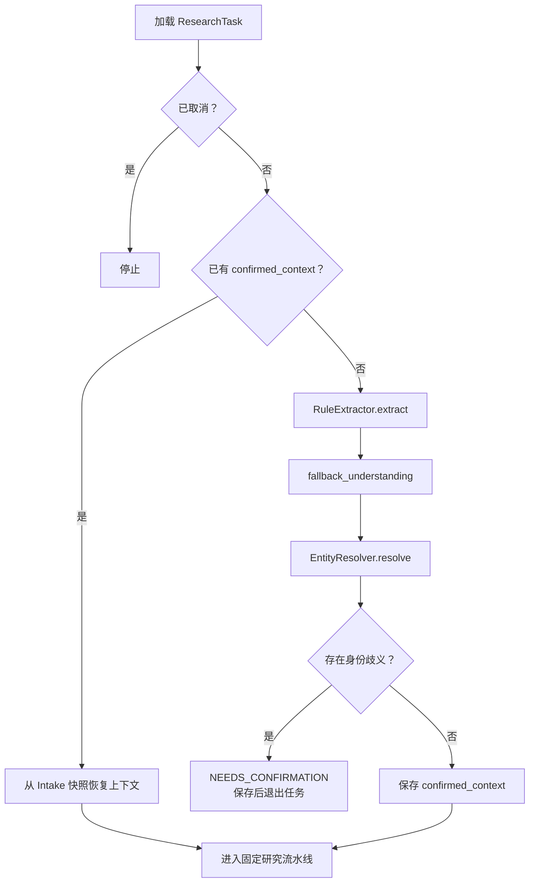

标准 intake 路径通常已经携带 `confirmed_context`。`/api/v1/tasks/text` 和 `/api/v1/tasks/audio` 仍保留兼容入口，因此 Pipeline 仍包含规则提取和任务级身份确认分支。用户确认完成后进入固定研究流水线。

#### 图 5.2：固定研究编排

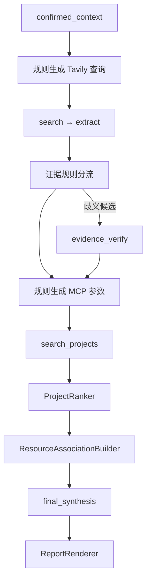

规则先把公开证据分成接受、拒绝和歧义三类，只有歧义候选交给 `evidence_verify`。Tavily 或 MCP 单路失败时记录降级状态并继续后续步骤。

#### 图 5.3：排序、关联与报告

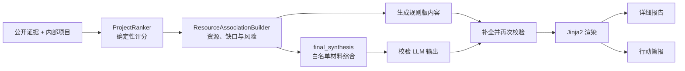

规则版内容始终先生成。`final_synthesis` 不可用或输出校验失败时使用规则版内容；成功时也会与规则版合并并再次校验，最后保存 `COMPLETED`。取消任务会在各阶段检查点停止；未处理异常将任务置为 `FAILED`。

### 图 6：外部调用边界

#### 图 6.1：公开信息

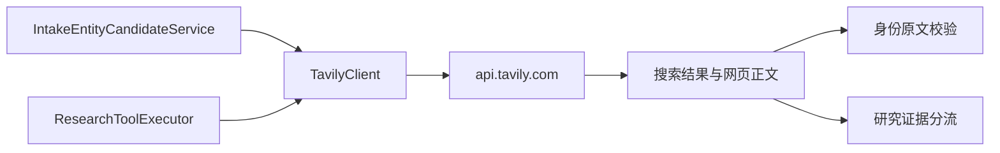

Intake Web 查询只用于未解决的身份补全；研究 Web 查询用于公开事实收集。LLM 不直接访问 Tavily，也不自行执行网络请求。

#### 图 6.2：内部资源

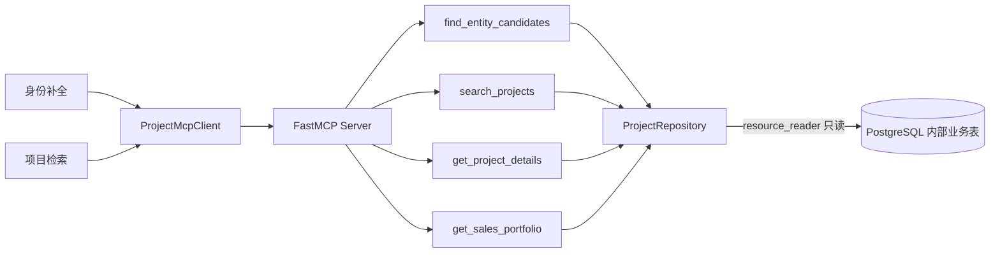

内部业务查询必须经过 MCP Server。LLM 只接收经过裁剪的上下文并输出结构化决策，不能直接访问应用数据库或内部业务表。

### 图 7：当前数据模型

#### 图 7.1：应用状态表

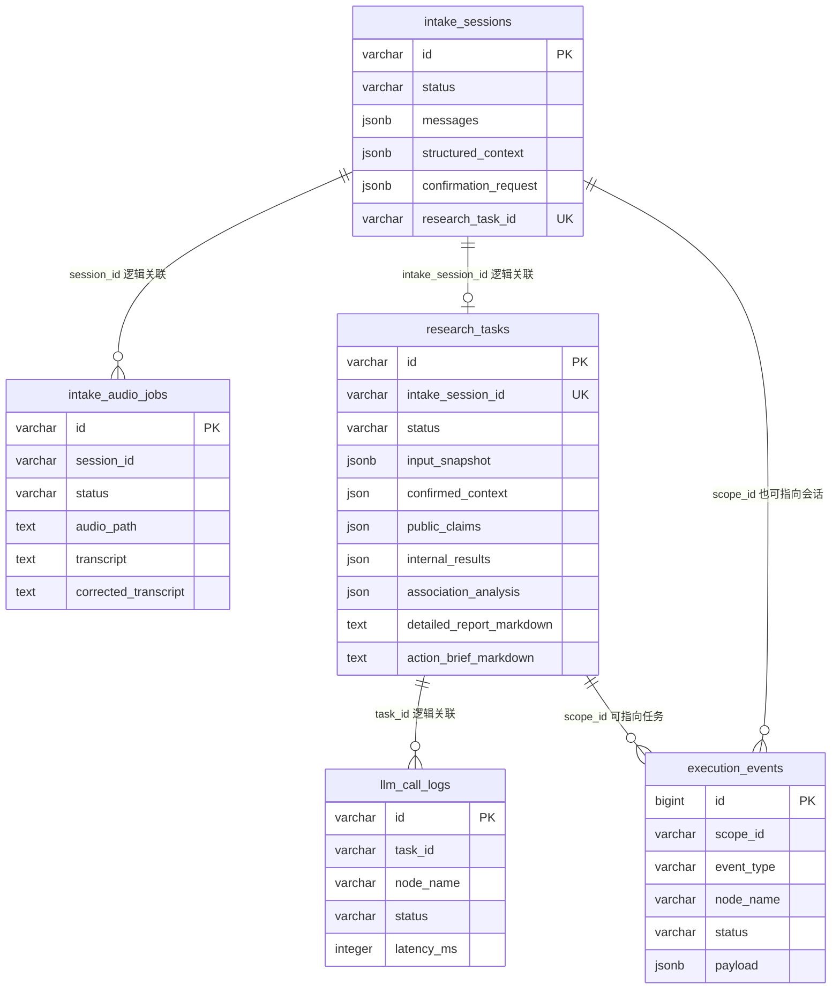

这些表由 `backend/app/models/database.py` 定义，并由 `init_database()` 在 FastAPI 启动时创建或补充迁移。图中的关系均为逻辑关联：ORM 当前没有为这些字段声明数据库外键。会话消息、实体、证据、项目匹配和报告主要保存在 JSON/Text 字段中。

#### 图 7.2：内部项目表

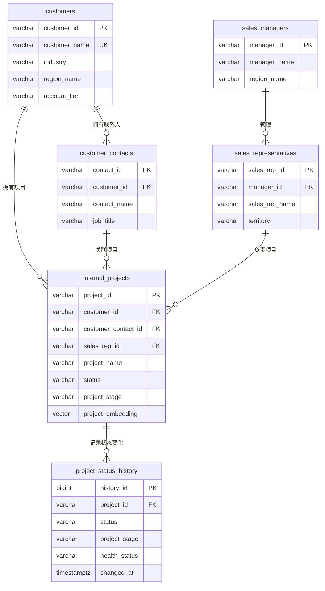

内部项目表和查询视图由 `seed/init.sql` 创建，`mcp_server/project_repository.py` 使用 `resource_reader` 只读账号查询。项目检索按人物/企业精确匹配、文本匹配和 HashingVectorizer 向量匹配组合返回结果。

建议但尚未实现的规范化表包括 User、ConversationMessage、CanonicalEntity、Evidence、ProjectMatch 和 Report；它们不属于当前物理模型。

### 图 8：Docker Compose 部署

#### 图 8.1：启动依赖

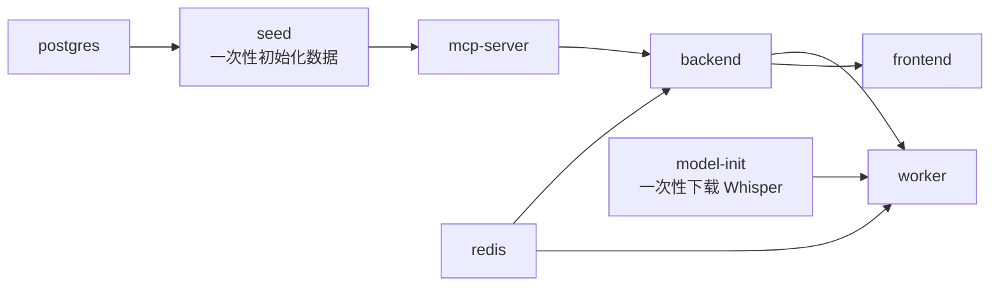

#### 图 8.2：运行时连接与卷

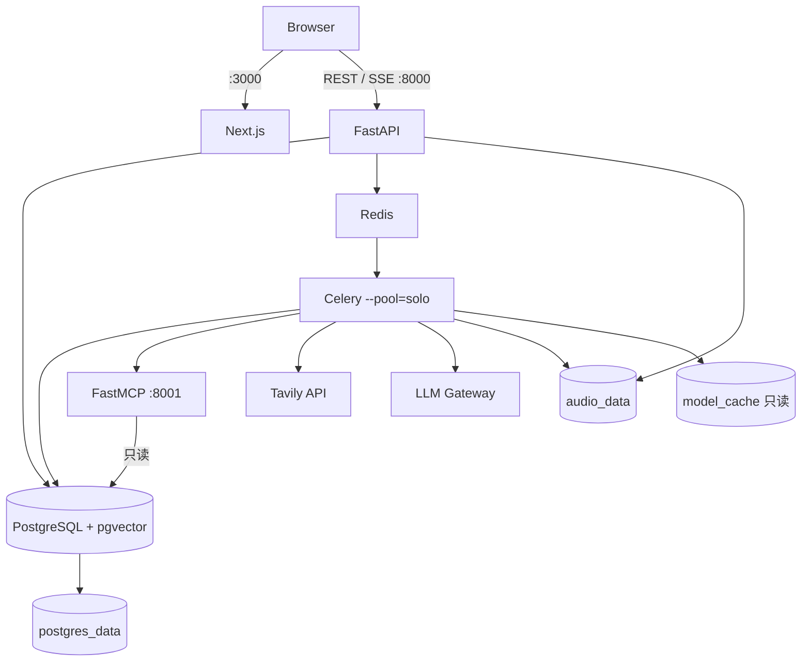

当前 Compose 暴露 `3000`、`8000` 和 `8001`，使用 `postgres_data`、`audio_data`、`model_cache` 三个命名卷。生产网关、TLS、认证授权、托管 Redis/PostgreSQL、对象存储和日志指标追踪仍属于未来规划。
