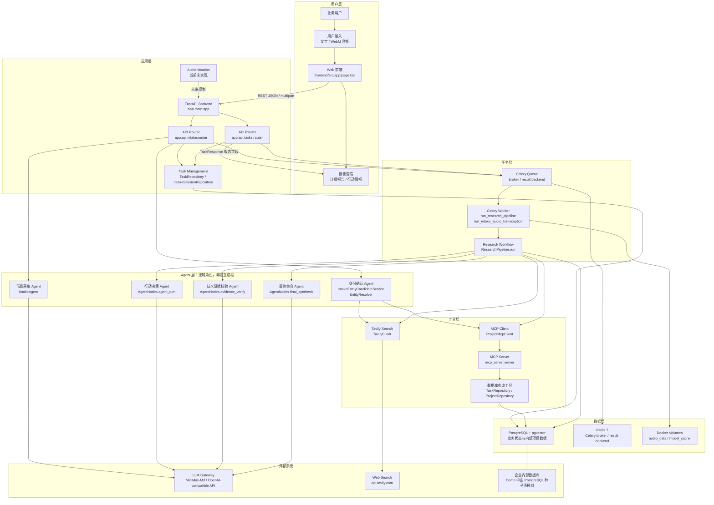
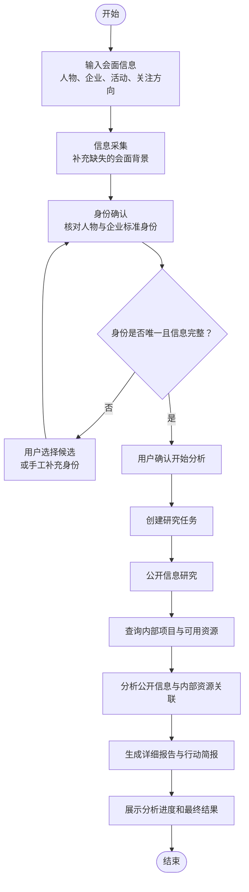
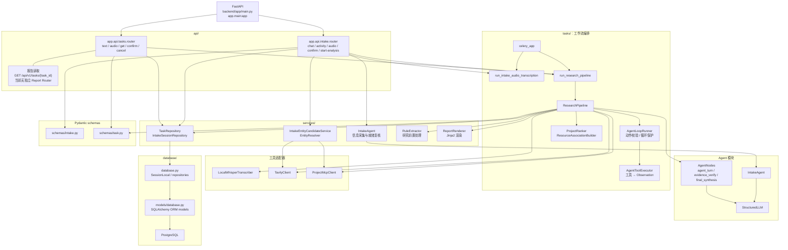
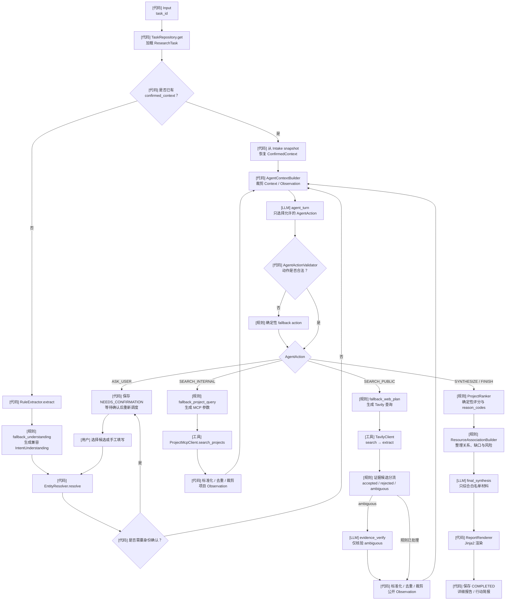
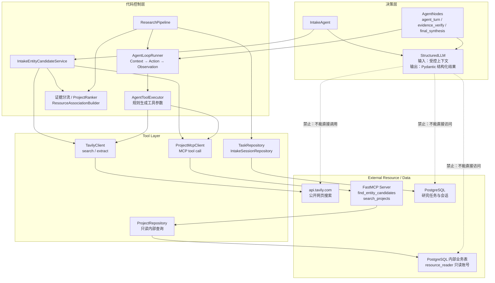
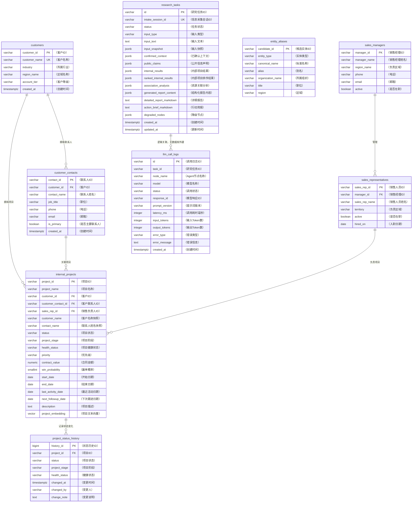

# 资源推动 Agent Demo

资源调查 Demo：规则提取与确定性降级、`MiniMax-M3` Chat Completions + Pydantic 结构化理解、intake 阶段受控的 Tavily 关键人身份补全、MCP 内部实体与项目查询、关联分析和 Jinja2 报告。

## 启动

1. 在 `.env` 中填写 `TAVILY_API_KEY`、`OPENAI_API_KEY` 和自行生成的随机 `LLM_SAFETY_SALT`。模型网关为 `https://vftllmapi.vf-tech.cn`，主模型与复核模型均为 `MiniMax-M3`，推理强度为 `xhigh`。
2. 执行：

```powershell
docker compose up --build
```

3. 打开 `http://localhost:3000`。

首次启动只下载本地 Whisper 模型。内部项目向量由 HashingVectorizer 即时生成，不下载嵌入模型。页面固定支持最新版桌面端 Chrome。

未配置 `OPENAI_API_KEY`、模型请求超时、输出格式错误或网关不可用时，七个大模型节点会标记为降级，任务继续使用规则、Tavily、MCP 和 Jinja2 生成基础报告。

固定文本测试：

```text
老板周五要和比亚迪股份有限公司的王传福董事长兼总裁吃饭，主要聊新能源和储能项目。
```

歧义确认测试：

```text
华星的李总明天参加会议
```

## 自动测试

```powershell
python -m venv .venv
.\.venv\Scripts\python -m pip install -r backend\requirements-test.txt
.\.venv\Scripts\python -m pytest backend\tests -q
cd frontend
npm install
npm run build
```

## 服务

- Web：`http://localhost:3000`
- API：`http://localhost:8000`
- API 文档：`http://localhost:8000/docs`
- MCP：`http://localhost:8001/mcp`

## 架构图

以下以当前代码为准。已有 `2026-07-21` 验收文档中的“无生成式大模型”等描述已经过期；当前实现已包含 `StructuredLLM`、Intake Agent 和七个研究节点。

当前边界：未实现 Authentication、Nginx/API Gateway、独立 Report API，也没有独立的 User、Entity、Evidence、Report 数据表。

## 图1：系统总体架构图

用途说明：展示当前系统分层、核心运行组件及外部依赖；括号内为真实工程模块。



模块说明：用户输入经 `page.tsx` 进入两个 FastAPI Router；Router 管理会话和任务，Celery 异步运行 `ResearchPipeline`；Agent 只产生结构化决策，工具负责实际检索；结果写入 PostgreSQL，并通过任务查询接口返回前端。

## 图2：业务流程图（用户视角）

用途说明：只描述用户能感知的业务过程，不体现代码模块。



模块说明：输入为用户提供的会面信息；输出为可追溯的公开研究、内部项目匹配和行动建议。身份不完整时流程回到用户确认，用户明确点击开始分析后才创建研究任务。

## 图3：后端服务架构图

用途说明：展示 FastAPI 后端当前真实代码组织和调用方向。工程没有独立的 `service/task_service.py`、`workflow/` 或 `agents/` 目录，下图映射到实际类。



模块说明：API 输入是 Pydantic 请求模型，输出是 Intake/Task 响应模型；`ResearchPipeline` 统一进入 `AgentLoopRunner`，由模型决定动作意图，规则代码生成工具参数并整理结果；`ProjectRanker` 和 `ResourceAssociationBuilder` 确定性运行，`ReportRenderer` 只渲染内容；所有持久化经 Repository 和 ORM 完成。

## 图4：Agent Workflow 详细图

用途说明：展示 `ResearchPipeline.run` 的控制流，并明确代码、LLM 和用户确认边界。



模块说明：业务 LLM 只保留 `agent_turn`、`evidence_verify` 和 `final_synthesis`。`agent_turn` 决定下一步意图但不生成工具参数；Tavily/MCP 参数、项目排序和资源关联均由确定性代码完成。工具原始结果经过标准化、去重和裁剪后形成 `Observation`，再进入下一轮 Context。循环受最大轮数、最大工具调用数和重复动作保护；身份无法确定时任务进入 `NEEDS_CONFIRMATION`。

## 图5：数据库 ER 关系图

用途说明：同时展示当前物理模型和建议的规范化模型。名称带 `_PROPOSED` 的实体当前不存在。

```mermaid
erDiagram
    IntakeSession["IntakeSession（信息采集会话）"] {
        string id PK "（信息采集会话ID）"
        string status "（状态）"
        jsonb messages "（消息记录）"
        jsonb structured_context "（结构化上下文）"
        jsonb confirmation_request "（确认请求）"
        string research_task_id UK "（研究任务ID）"
    }

    ResearchTask["ResearchTask（研究任务）"] {
        string id PK "（研究任务ID）"
        string intake_session_id UK "（信息采集会话ID）"
        string status "（状态）"
        json input_snapshot "（输入快照）"
        json confirmed_context "（已确认上下文）"
        json public_claims "（公开信息事实）"
        json internal_results "（内部项目查询结果）"
        json association_analysis "（关联分析）"
        text detailed_report_markdown "（详细报告Markdown）"
        text action_brief_markdown "（行动说明Markdown）"
    }

    IntakeAudioJob["IntakeAudioJob（信息采集音频任务）"] {
        string id PK "（音频任务ID）"
        string session_id "（信息采集会话ID）"
        string status "（状态）"
        text audio_path "（音频文件路径）"
        text transcript "（音频转写文本）"
    }

    LlmCallLog["LlmCallLog（大模型调用日志）"] {
        string id PK "（调用日志ID）"
        string task_id "（研究任务ID）"
        string node_name "（节点名称）"
        string status "（调用状态）"
        int latency_ms "（调用耗时，毫秒）"
    }

    Customer["Customer（客户）"] {
        string customer_id PK "（客户ID）"
        string customer_name "（客户名称）"
    }

    CustomerContact["CustomerContact（客户联系人）"] {
        string contact_id PK "（联系人ID）"
        string customer_id FK "（客户ID）"
        string contact_name "（联系人姓名）"
        string job_title "（职位）"
    }

    InternalProject["InternalProject（内部项目）"] {
        string project_id PK "（项目ID）"
        string customer_id FK "（客户ID）"
        string customer_contact_id FK "（客户联系人ID）"
        string sales_rep_id FK "（销售代表ID）"
        string project_name "（项目名称）"
        vector project_embedding "（项目向量）"
    }

    SalesManager["SalesManager（销售经理）"] {
        string manager_id PK "（销售经理ID）"
    }

    SalesRepresentative["SalesRepresentative（销售代表）"] {
        string sales_rep_id PK "（销售代表ID）"
        string manager_id FK "（销售经理ID）"
    }

    ProjectStatusHistory["ProjectStatusHistory（项目状态历史）"] {
        int history_id PK "（历史记录ID）"
        string project_id FK "（项目ID）"
    }

    UserAccount_PROPOSED["UserAccount_PROPOSED（用户账户，建议新增）"] {
        string id PK "（用户账户ID）"
        string login_name UK "（登录名称）"
        string display_name "（显示名称）"
    }

    ConversationMessage_PROPOSED["ConversationMessage_PROPOSED（会话消息，建议新增）"] {
        string id PK "（会话消息ID）"
        string intake_session_id FK "（信息采集会话ID）"
        string role "（消息角色）"
        text content "（消息内容）"
    }

    CanonicalEntity_PROPOSED["CanonicalEntity_PROPOSED（标准实体，建议新增）"] {
        string id PK "（标准实体ID）"
        string entity_type "（实体类型）"
        string canonical_name "（标准名称）"
    }

    ResearchEntity_PROPOSED["ResearchEntity_PROPOSED（研究实体关联，建议新增）"] {
        string task_id FK "（研究任务ID）"
        string entity_id FK "（标准实体ID）"
        string confirmed_by "（确认方式）"
    }

    Evidence_PROPOSED["Evidence_PROPOSED（证据，建议新增）"] {
        string id PK "（证据ID）"
        string task_id FK "（研究任务ID）"
        string source_type "（来源类型）"
        text claim "（事实陈述）"
        text source_url "（来源链接）"
    }

    ProjectMatch_PROPOSED["ProjectMatch_PROPOSED（项目匹配，建议新增）"] {
        string task_id FK "（研究任务ID）"
        string project_id FK "（项目ID）"
        float relevance_score "（相关性评分）"
    }

    Report_PROPOSED["Report_PROPOSED（报告，建议新增）"] {
        string id PK "（报告ID）"
        string task_id FK "（研究任务ID）"
        string report_type "（报告类型）"
        text markdown "（Markdown报告内容）"
    }

    IntakeSession ||--o| ResearchTask : "逻辑一对一"
    IntakeSession ||--o{ IntakeAudioJob : "session_id 逻辑关联"
    ResearchTask ||--o{ LlmCallLog : "task_id 逻辑关联"

    Customer ||--o{ CustomerContact : "has（拥有）"
    Customer ||--o{ InternalProject : "owns（拥有）"
    CustomerContact ||--o{ InternalProject : "contacts（负责联系）"
    SalesManager ||--o{ SalesRepresentative : "manages（管理）"
    SalesRepresentative ||--o{ InternalProject : "owns（负责）"
    InternalProject ||--o{ ProjectStatusHistory : "records（记录）"

    UserAccount_PROPOSED ||--o{ IntakeSession : "owns（拥有）"
    IntakeSession ||--o{ ConversationMessage_PROPOSED : "contains（包含）"
    ResearchTask ||--o{ ResearchEntity_PROPOSED : "identifies（识别）"
    CanonicalEntity_PROPOSED ||--o{ ResearchEntity_PROPOSED : "referenced_by（被引用）"
    ResearchTask ||--o{ Evidence_PROPOSED : "collects（收集）"
    ResearchTask ||--o{ ProjectMatch_PROPOSED : "matches（匹配）"
    InternalProject ||--o{ ProjectMatch_PROPOSED : "referenced_by（被引用）"
    ResearchTask ||--o{ Report_PROPOSED : "generates（生成）"
```



模块说明：当前会话消息、实体、证据、项目匹配和报告主要内嵌在 JSON/Text 字段中；应用表之间多数只有逻辑 ID，没有数据库外键。建议新增用户、消息、标准实体、证据、项目匹配和报告表，以支持权限、审计、检索和版本管理。

## 图6：外部工具调用关系图

用途说明：展示 Agent、工具适配器和外部资源的访问边界，强调 LLM 不直接访问数据库或外部工具。



模块说明：`agent_turn` 输入经过裁剪的 `AgentContext`，只输出动作意图；`evidence_verify` 只接收规则无法判断的证据候选；`final_synthesis` 只接收已确认材料。LLM 不生成 Tavily 查询、MCP 参数或项目排序，真正的网络和数据库访问由 Python 工具类完成；内部业务查询必须经过 MCP Server 的 `ProjectRepository` 和只读账号。

## 图7：部署架构图

用途说明：区分当前 Docker Compose 开发部署与尚未实现的生产部署。

```mermaid
flowchart TB
    subgraph DEV["当前开发环境"]
        Developer["Developer"]
        Git["Git Repository<br/>resource-agent-demo"]
        Compose["Docker Compose"]

        BrowserDev["Browser"]
        FrontendDev["frontend<br/>Next.js :3000"]
        BackendDev["backend<br/>Uvicorn/FastAPI :8000"]
        WorkerDev["worker<br/>Celery --pool=solo"]
        MCPDev["mcp-server<br/>FastMCP :8001"]
        RedisDev["redis:7-alpine"]
        PGDev["pgvector/pgvector:pg16"]
        VolumesDev["audio_data / model_cache / postgres_data"]

        Developer --> Git --> Compose
        Compose --> FrontendDev
        Compose --> BackendDev
        Compose --> WorkerDev
        Compose --> MCPDev
        Compose --> RedisDev
        Compose --> PGDev

        BrowserDev -->|"HTTP :3000"| FrontendDev
        FrontendDev -->|"REST :8000"| BackendDev
        BackendDev -->|"enqueue"| RedisDev
        WorkerDev -->|"consume / result"| RedisDev
        BackendDev --> PGDev
        WorkerDev --> PGDev
        WorkerDev --> MCPDev --> PGDev
        WorkerDev --> VolumesDev
        PGDev --> VolumesDev
    end

    subgraph PROD["生产环境：未来规划，当前仓库未实现"]
        BrowserProd["Browser"]
        Gateway["Nginx / API Gateway<br/>TLS、路由、限流"]
        AuthProd["Authentication / Authorization"]
        FrontendProd["Next.js Runtime 或静态托管"]
        FastAPIProd["FastAPI Replicas"]
        RedisProd["Managed Redis<br/>broker / result backend"]
        WorkerProd["Celery Worker Pool"]
        MCPProd["Private MCP Server"]
        PGProd["Managed PostgreSQL / pgvector"]
        ObjectStore["Object Storage<br/>音频与导出报告"]
        Observability["Logs / Metrics / Tracing"]

        BrowserProd --> Gateway
        Gateway --> FrontendProd
        Gateway --> AuthProd --> FastAPIProd
        FastAPIProd -->|"enqueue"| RedisProd
        RedisProd -->|"consume"| WorkerProd
        FastAPIProd --> PGProd
        WorkerProd --> PGProd
        WorkerProd --> MCPProd --> PGProd
        WorkerProd --> ObjectStore
        FastAPIProd --> Observability
        WorkerProd --> Observability
        MCPProd --> Observability
    end
```



模块说明：当前环境通过 Docker Compose 暴露 `3000/8000/8001`，没有反向代理、TLS、认证或集中可观测性；生产建议由网关统一接入，FastAPI 只负责入队，Celery 从 Redis 消费任务，PostgreSQL 和对象存储负责持久化。


## 图8 resource_agent ER 关系图



注意：entity_aliases 当前没有外键；research_tasks 与 llm_call_logs 通过 task_id 逻辑关联，但数据库未建立外键。当前运行库中也没有代码模型里定义的 intake_sessions 和 intake_audio_jobs 表。
