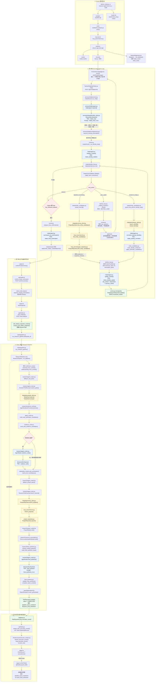
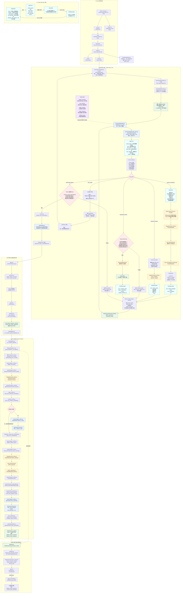

```mermaid
flowchart TB
    subgraph BOOT["1. Docker 服务启动"]
        direction LR
        B0["docker compose -p resource-agent-demo up --build"]
        B1["postgres<br/>seed/init.sql"]
        B2["seed<br/>seed/seed_projects.py<br/>main()"]
        B3["mcp-server<br/>mcp_server/server.py"]
        B4["backend<br/>uvicorn app.main:app"]
        B5["worker<br/>Celery worker"]
        B6["frontend<br/>Next.js :3000"]
        B7["model-init<br/>seed/model_init.py<br/>main()"]

        B0 --> B1 --> B2 --> B3
        B0 --> B7
        B3 --> B4 --> B5
        B4 --> B6
    end

    B4 --> APP["backend/app/main.py<br/>lifespan() → init_database()<br/>注册 intake_router / tasks_router"]
    B6 --> UI

    subgraph INTAKE["2. 用户输入与 Intake Agent Loop"]
        UI["frontend/src/app/page.tsx<br/>Home()<br/>sendChatMessage()<br/>输入：今晚和中建二局刘希川吃饭"]
        API_CHAT["backend/app/api/intake.py<br/>chat()<br/>POST /api/v1/intake/chat"]
        RUNNER["services/intake/runner.py<br/>IntakeRunner.run_chat()"]
        CHAT_LLM["services/intake/agent.py<br/>IntakeAgent.respond()"]
        LLM_PARSE1["services/integrations/llm_client.py<br/>StructuredLLM.parse()<br/>节点：intake_chat<br/>Prompt：intake_chat_v1.txt"]
        COMPLETE["services/intake/completeness.py<br/>required_missing_information()"]
        INIT_LOOP["runner.py<br/>IntakeRunner._run_identity_loop()"]
        INIT_CTX["intake/agent.py<br/>initialize_context()<br/>节点：intake_identity_initialize"]
        LOOP["intake/identity_loop.py<br/>IntakeIdentityLoop.run()"]
        VALIDATE["IntakeActionValidator.validate()<br/>_apply_hard_constraints()"]
        ACTION{"next_action"}

        UI --> API_CHAT --> RUNNER
        RUNNER --> CHAT_LLM --> LLM_PARSE1
        LLM_PARSE1 -->|"提取：刘希川 / 中建二局 / 宴请 / 今晚"| COMPLETE
        COMPLETE -->|"至少存在人物或企业"| INIT_LOOP
        INIT_LOOP --> INIT_CTX --> LOOP
        LOOP --> VALIDATE --> ACTION

        ACTION -->|"SEARCH_INTERNAL"| INTERNAL["intake/entity_candidates.py<br/>lookup_internal()"]
        INTERNAL --> MCP_CLIENT["integrations/mcp_client.py<br/>ProjectMcpClient.find_entity_candidates()"]
        MCP_CLIENT --> MCP_TOOL["mcp_server/server.py<br/>find_entity_candidates()"]
        MCP_TOOL --> MCP_REPO["mcp_server/project_repository.py<br/>ProjectRepository.find_entity_candidates()"]
        MCP_REPO -->|"查询 customers / customer_contacts"| OBS["identity_loop.py<br/>生成 IntakeToolAttempt<br/>区分 technical_status 与 information_status"]

        ACTION -->|"SEARCH_PUBLIC"| PUBLIC["intake/entity_candidates.py<br/>search_key_person_identity_web()"]
        PUBLIC --> TAV_ID["integrations/tavily_client.py<br/>search_identity()<br/>extract_identity()"]
        TAV_ID --> NORMALIZE["intake/agent.py<br/>normalize_external_identity()<br/>节点：intake_identity_normalize"]
        NORMALIZE --> VERIFY_ID["entity_candidates.py<br/>verify_identity_evidence()<br/>apply_automatic_candidates()"]
        VERIFY_ID --> OBS

        OBS --> UPDATE_CTX["intake/agent.py<br/>update_context()<br/>节点：intake_identity_update<br/>old_context + observation<br/>+ success_criteria"]
        UPDATE_CTX --> SAVE_CTX["runner.py checkpoint()<br/>IntakeSessionRepository.update()<br/>持久化 structured_context"]
        SAVE_CTX --> LOOP

        ACTION -->|"ASK_USER"| WAIT["identity_loop.py<br/>_waiting_context() / _finish()<br/>状态：WAITING_USER"]
        WAIT --> PERSIST["runner.py<br/>保存 user_question<br/>请求结束，不阻塞进程"]
        PERSIST --> USER_FIX["用户补充：<br/>指中国建筑第二工程局有限公司的刘希川"]
        USER_FIX --> UI

        ACTION -->|"READY"| HARD_GATE{"Python 硬 Gate<br/>has_resolved_entities()"}
        HARD_GATE -->|"不通过"| LOOP
        HARD_GATE -->|"通过"| FINAL_SUMMARY["runner.py<br/>prepare_final_confirmation()"]
        FINAL_SUMMARY --> SUMMARY_LLM["intake/agent.py<br/>summarize_for_confirmation()<br/>节点：intake_final_confirmation"]
        SUMMARY_LLM --> AWAIT["IntakeSession 状态<br/>AWAITING_FINAL_CONFIRMATION"]
    end

    subgraph CONFIRM["3. 用户确认并创建研究任务"]
        CONFIRM_UI["page.tsx<br/>confirmFinalSummary()"]
        CONFIRM_API["api/intake.py<br/>confirm_intake_summary()<br/>POST /confirm-summary"]
        READY_STATE["derive_field_states()<br/>required_missing_information()<br/>状态改为 READY"]
        START_UI["page.tsx<br/>startAnalysis()"]
        START_API["api/intake.py<br/>start_analysis()<br/>POST /start-analysis"]
        SNAPSHOT["with_default_requester_context()<br/>context_from_intake_snapshot()<br/>创建 ResearchTask"]
        CELERY["tasks/pipeline.py<br/>run_research_pipeline.delay(task_id)"]

        AWAIT --> CONFIRM_UI --> CONFIRM_API --> READY_STATE
        READY_STATE --> START_UI --> START_API --> SNAPSHOT --> CELERY
    end

    subgraph RESEARCH["4. Celery 固定 Research Pipeline"]
        WORKER["tasks/pipeline.py<br/>run_research_pipeline()"]
        PIPE["ResearchPipeline.run()<br/>ResearchPipeline._run_pipeline()"]
        CONTEXT["恢复 confirmed_context<br/>extracted_from_context()<br/>understanding_from_context()"]

        WEB_PLAN["research/agent_nodes.py<br/>fallback_web_plan()"]
        WEB_SEARCH["research/agent_tools.py<br/>ResearchToolExecutor.search_public()"]
        TAV_SEARCH["integrations/tavily_client.py<br/>TavilyClient.search()<br/>TavilyClient.extract()"]
        EVIDENCE["research/evidence_verify.py<br/>AgentEvidenceProcessor.process()"]
        EVIDENCE_BUILD["agent_nodes.py<br/>build_web_verification_candidates()"]
        EVIDENCE_ROUTE["evidence_verify.py<br/>route_web_evidence_candidates()"]
        AMBIGUOUS{"存在歧义证据？"}
        VERIFY_LLM["research/agent_nodes.py<br/>AgentNodes.evidence_verify()"]
        VERIFY_PARSE["StructuredLLM.parse()<br/>节点：evidence_verify"]
        CLAIMS["materialize_routed_web_verifications()<br/>claims_from_verifications()"]

        PROJECT_PLAN["research/agent_nodes.py<br/>fallback_project_query()"]
        PROJECT_SEARCH["research/agent_tools.py<br/>ResearchToolExecutor.search_internal()"]
        MCP_PROJECT_CLIENT["integrations/mcp_client.py<br/>ProjectMcpClient.search_projects()"]
        MCP_PROJECT_TOOL["mcp_server/server.py<br/>search_projects()"]
        MCP_PROJECT_REPO["project_repository.py<br/>ProjectRepository.search()"]

        RANK["research/project_ranker.py<br/>ProjectRanker.rank()"]
        ASSOC["research/resource_association.py<br/>ResourceAssociationBuilder.build()"]
        ORDER["research/final_synthesis.py<br/>ordered_ranked_projects()<br/>build_final_synthesis_input()"]
        SYNTHESIS["research/agent_nodes.py<br/>AgentNodes.final_synthesis()"]
        FINAL_LLM["StructuredLLM.parse()<br/>节点：final_synthesis<br/>Prompt：final_synthesis_v1.txt"]
        VALIDATE_REPORT["final_synthesis.py<br/>validate_final_synthesis()<br/>complete_report_content()"]
        RENDER["reporting/renderer.py<br/>ReportRenderer.render_generated()"]
        COMPLETE_TASK["TaskRepository.update()<br/>status = COMPLETED<br/>保存 detailed_report_markdown<br/>和 action_brief_markdown"]

        CELERY --> WORKER --> PIPE --> CONTEXT
        CONTEXT --> WEB_PLAN --> WEB_SEARCH --> TAV_SEARCH
        TAV_SEARCH --> EVIDENCE --> EVIDENCE_BUILD --> EVIDENCE_ROUTE --> AMBIGUOUS
        AMBIGUOUS -->|"是"| VERIFY_LLM --> VERIFY_PARSE --> CLAIMS
        AMBIGUOUS -->|"否，规则直接接受/拒绝"| CLAIMS

        CLAIMS --> PROJECT_PLAN --> PROJECT_SEARCH
        PROJECT_SEARCH --> MCP_PROJECT_CLIENT --> MCP_PROJECT_TOOL --> MCP_PROJECT_REPO
        MCP_PROJECT_REPO --> RANK --> ASSOC --> ORDER
        ORDER --> SYNTHESIS --> FINAL_LLM --> VALIDATE_REPORT
        VALIDATE_REPORT --> RENDER --> COMPLETE_TASK
    end

    subgraph STREAM["5. 实时进度与最终报告展示"]
        EVENT_DB["database.py<br/>TaskRepository.log_execution_event()"]
        SSE_API["api/tasks.py<br/>stream_task_execution_events()<br/>GET /api/v1/tasks/{id}/events"]
        SSE_STREAM["infrastructure/execution_stream.py<br/>stream_execution_events()<br/>map_execution_event()<br/>encode_sse()"]
        EVENT_SOURCE["page.tsx<br/>EventSource / receiveEvent()"]
        GET_TASK["page.tsx fetchTask()<br/>api/tasks.py get_task()"]
        REPORT_UI["前端报告视图<br/>展示 detailed_report_markdown<br/>与 action_brief_markdown"]

        PIPE -.各阶段事件.-> EVENT_DB
        EVENT_DB --> SSE_API --> SSE_STREAM --> EVENT_SOURCE
        COMPLETE_TASK --> EVENT_DB
        EVENT_SOURCE -->|"收到 DONE"| GET_TASK --> REPORT_UI
    end

    classDef llm fill:#e8f1ff,stroke:#2563eb,color:#111;
    classDef tool fill:#fff4d6,stroke:#ca8a04,color:#111;
    classDef store fill:#e9f7ec,stroke:#15803d,color:#111;
    classDef decision fill:#fdecec,stroke:#dc2626,color:#111;

    class CHAT_LLM,LLM_PARSE1,INIT_CTX,UPDATE_CTX,NORMALIZE,SUMMARY_LLM,VERIFY_LLM,VERIFY_PARSE,SYNTHESIS,FINAL_LLM llm;
    class MCP_CLIENT,MCP_TOOL,MCP_REPO,TAV_ID,TAV_SEARCH,MCP_PROJECT_CLIENT,MCP_PROJECT_TOOL,MCP_PROJECT_REPO tool;
    class SAVE_CTX,SNAPSHOT,COMPLETE_TASK,EVENT_DB store;
    class ACTION,HARD_GATE,AMBIGUOUS decision;
```

```mermaid
flowchart TB
    subgraph BOOT["1. Docker 服务启动"]
        direction LR
        B0["docker compose -p resource-agent-demo up --build"]
        B1["postgres<br/>seed/init.sql"]
        B2["seed<br/>seed/seed_projects.py<br/>main()"]
        B3["mcp-server<br/>mcp_server/server.py"]
        B4["backend<br/>uvicorn app.main:app"]
        B5["worker<br/>Celery worker"]
        B6["frontend<br/>Next.js :3000"]
        B7["model-init<br/>seed/model_init.py<br/>main()"]

        B0 --> B1 --> B2 --> B3
        B0 --> B7
        B3 --> B4 --> B5
        B4 --> B6
    end

    B4 --> APP["backend/app/main.py<br/>lifespan() → init_database()<br/>注册 intake_router / tasks_router"]
    B6 --> UI


    subgraph INTAKE["2. 用户输入与统一 Intake Agent Loop"]

        UI["frontend/src/app/page.tsx<br/>Home()<br/>sendChatMessage()<br/>输入：下周和中建二局刘总吃饭，聊智慧电站"]

        API_CHAT["backend/app/api/intake.py<br/>chat()<br/>POST /api/v1/intake/chat"]

        RUNNER["services/intake/runner.py<br/>IntakeRunner.run_chat()<br/>负责单次 HTTP 请求编排"]

        LOAD_STATE["读取 / 创建 AgentState<br/>当前已知事实 + 实体 + Observation<br/>+ ToolAttempt + 用户历史回复"]

        AGENT["services/intake/agent.py<br/>IntakeAgent.run_turn()<br/>统一 Intake 大模型"]

        SKILLS["Intake Skills<br/><br/>identity_resolution<br/>身份识别与企业/人物关联<br/><br/>new_customer<br/>新客户确认与建档规则<br/><br/>public_research<br/>公网身份补充规则<br/><br/>intake_readiness<br/>信息完整度与追问规则<br/><br/>database_query<br/>内部查询规划规则"]

        LLM_PARSE["services/integrations/llm_client.py<br/>StructuredLLM.parse()<br/>Prompt：intake_agent_v1.txt<br/>输出：AgentTurn"]

        TURN["AgentTurn<br/><br/>context_patch：本轮新理解的信息<br/>skill：当前使用的 Skill<br/>next_action：下一动作<br/>query_plan：结构化查询计划<br/>user_message：需要时向用户追问<br/>reason：选择原因"]

        VALIDATE["Python Validator<br/><br/>Schema 校验<br/>Action 权限校验<br/>重复动作检查<br/>Loop 次数限制<br/>查询安全检查<br/>写库权限检查"]

        ACTION{"next_action"}

        UI --> API_CHAT --> RUNNER --> LOAD_STATE
        LOAD_STATE --> AGENT
        SKILLS -.按当前任务提供行为规则.-> AGENT
        AGENT --> LLM_PARSE --> TURN
        TURN --> VALIDATE --> ACTION


        %% =========================
        %% 内部查询
        %% =========================

        ACTION -->|"QUERY_INTERNAL"| QUERY_PLAN["QueryPlan<br/><br/>目标实体<br/>企业候选名称 / 别名<br/>人物姓名片段<br/>职位片段<br/>实体关系<br/>是否扩展关联企业<br/>返回数量限制"]

        QUERY_PLAN --> QUERY_COMPILER["Python Query Executor / Compiler<br/><br/>把 QueryPlan 转成安全查询<br/>不让 LLM 直接任意执行数据库"]

        QUERY_COMPILER --> MCP_CLIENT["integrations/mcp_client.py<br/>ProjectMcpClient"]

        MCP_CLIENT --> MCP_TOOL["mcp_server/server.py<br/>受控 MCP 查询工具"]

        MCP_TOOL --> MCP_REPO["mcp_server/project_repository.py<br/>ProjectRepository"]

        MCP_REPO --> INTERNAL_DB["PostgreSQL<br/><br/>customers<br/>customer_contacts<br/>internal_projects<br/>关联客户 / 子公司等"]

        INTERNAL_DB --> OBS_INTERNAL["ToolObservation<br/><br/>tool = internal_database<br/>status<br/>rows / candidates<br/>error"]


        %% =========================
        %% 公网查询
        %% =========================

        ACTION -->|"SEARCH_PUBLIC"| PUBLIC_PLAN["Public QueryPlan<br/><br/>需要验证的人物 / 企业<br/>已知企业范围<br/>标准名猜测 / 别名<br/>希望补充的信息"]

        PUBLIC_PLAN --> TAV_ID["integrations/tavily_client.py<br/>search_identity()<br/>search() / extract()"]

        TAV_ID --> OBS_PUBLIC["ToolObservation<br/><br/>tool = public_search<br/>网页证据<br/>候选身份<br/>来源 URL<br/>error"]


        %% =========================
        %% Tool Observation 回流
        %% =========================

        OBS_INTERNAL --> MERGE_OBS
        OBS_PUBLIC --> MERGE_OBS

        MERGE_OBS["Python Context Merge / Reducer<br/><br/>合并 context_patch<br/>记录 Observation<br/>更新候选<br/>记录 ToolAttempt<br/>不把候选自动当成确认事实"]

        MERGE_OBS --> SAVE_STATE["IntakeSessionRepository.update()<br/>持久化 AgentState / structured_context"]

        SAVE_STATE --> AGENT


        %% =========================
        %% 向用户追问
        %% =========================

        ACTION -->|"ASK_USER"| WAIT["生成用户问题<br/><br/>例如：<br/>内部客户库暂未找到“北辰能源”，<br/>请确认这是新客户吗？"]

        WAIT --> WAIT_STATE["保存 AgentState<br/>状态：WAITING_USER<br/>请求结束，不阻塞进程"]

        WAIT_STATE --> USER_REPLY["用户补充 / 确认<br/><br/>例如：<br/>是，这是刚接触的新客户"]

        USER_REPLY --> UI


        %% =========================
        %% 新客户写入请求
        %% =========================

        ACTION -->|"REQUEST_WRITE"| WRITE_GATE{"Python Write Gate<br/><br/>用户是否明确确认？<br/>是否已经查询内部？<br/>是否确实无重复客户？<br/>最低建档字段是否满足？<br/>当前写操作是否被允许？"}

        WRITE_GATE -->|"不通过"| WRITE_REJECT["生成 ToolObservation<br/>write_request = REJECTED<br/>附拒绝原因"]

        WRITE_REJECT --> MERGE_OBS

        WRITE_GATE -->|"通过"| WRITE_SERVICE["CustomerWriteService<br/>受控客户写入服务"]

        WRITE_SERVICE --> WRITE_DB["PostgreSQL<br/>写入新客户 / 新客户线索"]

        WRITE_DB --> OBS_WRITE["ToolObservation<br/><br/>tool = customer_write<br/>status = SUCCESS / FAILED<br/>created_customer_id"]

        OBS_WRITE --> MERGE_OBS


        %% =========================
        %% READY
        %% =========================

        ACTION -->|"PROPOSE_READY"| HARD_GATE{"Python 最终硬 Gate<br/><br/>required_missing_information()<br/>关键实体是否已确认？<br/>是否存在未解决候选？<br/>是否满足分析最低条件？"}

        HARD_GATE -->|"不通过"| READY_REJECT["生成 Observation<br/>READY_REJECTED<br/>说明仍缺什么"]

        READY_REJECT --> MERGE_OBS

        HARD_GATE -->|"通过"| FINAL_SUMMARY["runner.py<br/>prepare_final_confirmation()"]

        FINAL_SUMMARY --> SUMMARY_LLM["intake/agent.py<br/>summarize_for_confirmation()<br/>生成面向用户的最终确认摘要"]

        SUMMARY_LLM --> AWAIT["IntakeSession 状态<br/>AWAITING_FINAL_CONFIRMATION"]
    end


    subgraph CONTRACT["2.1 Intake Agent 统一契约"]

        C_STATE["AgentState<br/><br/>facts：已确认/已整理事实<br/>entities：人物与企业状态<br/>observations：工具结果<br/>tool_attempts：历史工具调用<br/>pending_user_question：待用户回答"]

        C_TURN["AgentTurn<br/><br/>context_patch<br/>skill<br/>next_action<br/>query_plan<br/>user_message<br/>reason"]

        C_QUERY["QueryPlan<br/><br/>LLM 表达“想查什么”<br/>不直接拥有数据库执行权限"]

        C_OBS["ToolObservation<br/><br/>Python / Tool 表达<br/>“实际查到了什么”"]

        C_STATE -->|"输入"| C_TURN
        C_TURN -->|"需要工具时"| C_QUERY
        C_QUERY -->|"Python 执行"| C_OBS
        C_OBS -->|"Reducer 更新"| C_STATE
    end


    subgraph CONFIRM["3. 用户确认并创建研究任务"]

        CONFIRM_UI["page.tsx<br/>confirmFinalSummary()"]

        CONFIRM_API["api/intake.py<br/>confirm_intake_summary()<br/>POST /confirm-summary"]

        READY_STATE["Python 最终确认<br/>状态改为 READY"]

        START_UI["page.tsx<br/>startAnalysis()"]

        START_API["api/intake.py<br/>start_analysis()<br/>POST /start-analysis"]

        SNAPSHOT["with_default_requester_context()<br/>context_from_intake_snapshot()<br/>创建 ResearchTask"]

        CELERY["tasks/pipeline.py<br/>run_research_pipeline.delay(task_id)"]

        AWAIT --> CONFIRM_UI --> CONFIRM_API --> READY_STATE
        READY_STATE --> START_UI --> START_API --> SNAPSHOT --> CELERY
    end


    subgraph RESEARCH["4. Celery 固定 Research Pipeline"]

        WORKER["tasks/pipeline.py<br/>run_research_pipeline()"]

        PIPE["ResearchPipeline.run()<br/>ResearchPipeline._run_pipeline()"]

        CONTEXT["恢复 confirmed_context<br/>extracted_from_context()<br/>understanding_from_context()"]


        WEB_PLAN["research/agent_nodes.py<br/>fallback_web_plan()"]

        WEB_SEARCH["research/agent_tools.py<br/>ResearchToolExecutor.search_public()"]

        TAV_SEARCH["integrations/tavily_client.py<br/>TavilyClient.search()<br/>TavilyClient.extract()"]

        EVIDENCE["research/evidence_verify.py<br/>AgentEvidenceProcessor.process()"]

        EVIDENCE_BUILD["agent_nodes.py<br/>build_web_verification_candidates()"]

        EVIDENCE_ROUTE["evidence_verify.py<br/>route_web_evidence_candidates()"]

        AMBIGUOUS{"存在歧义证据？"}

        VERIFY_LLM["research/agent_nodes.py<br/>AgentNodes.evidence_verify()"]

        VERIFY_PARSE["StructuredLLM.parse()<br/>节点：evidence_verify"]

        CLAIMS["materialize_routed_web_verifications()<br/>claims_from_verifications()"]


        PROJECT_PLAN["research/agent_nodes.py<br/>fallback_project_query()"]

        PROJECT_SEARCH["research/agent_tools.py<br/>ResearchToolExecutor.search_internal()"]

        MCP_PROJECT_CLIENT["integrations/mcp_client.py<br/>ProjectMcpClient.search_projects()"]

        MCP_PROJECT_TOOL["mcp_server/server.py<br/>search_projects()"]

        MCP_PROJECT_REPO["project_repository.py<br/>ProjectRepository.search()"]


        RANK["research/project_ranker.py<br/>ProjectRanker.rank()"]

        ASSOC["research/resource_association.py<br/>ResourceAssociationBuilder.build()"]

        ORDER["research/final_synthesis.py<br/>ordered_ranked_projects()<br/>build_final_synthesis_input()"]

        SYNTHESIS["research/agent_nodes.py<br/>AgentNodes.final_synthesis()"]

        FINAL_LLM["StructuredLLM.parse()<br/>节点：final_synthesis<br/>Prompt：final_synthesis_v1.txt"]

        VALIDATE_REPORT["final_synthesis.py<br/>validate_final_synthesis()<br/>complete_report_content()"]

        RENDER["reporting/renderer.py<br/>ReportRenderer.render_generated()"]

        COMPLETE_TASK["TaskRepository.update()<br/>status = COMPLETED<br/>保存 detailed_report_markdown<br/>和 action_brief_markdown"]


        CELERY --> WORKER --> PIPE --> CONTEXT

        CONTEXT --> WEB_PLAN --> WEB_SEARCH --> TAV_SEARCH

        TAV_SEARCH --> EVIDENCE --> EVIDENCE_BUILD --> EVIDENCE_ROUTE --> AMBIGUOUS

        AMBIGUOUS -->|"是"| VERIFY_LLM --> VERIFY_PARSE --> CLAIMS

        AMBIGUOUS -->|"否，规则直接接受/拒绝"| CLAIMS

        CLAIMS --> PROJECT_PLAN --> PROJECT_SEARCH

        PROJECT_SEARCH --> MCP_PROJECT_CLIENT --> MCP_PROJECT_TOOL --> MCP_PROJECT_REPO

        MCP_PROJECT_REPO --> RANK --> ASSOC --> ORDER

        ORDER --> SYNTHESIS --> FINAL_LLM --> VALIDATE_REPORT

        VALIDATE_REPORT --> RENDER --> COMPLETE_TASK
    end


    subgraph STREAM["5. 实时进度与最终报告展示"]

        EVENT_DB["database.py<br/>TaskRepository.log_execution_event()"]

        SSE_API["api/tasks.py<br/>stream_task_execution_events()<br/>GET /api/v1/tasks/{id}/events"]

        SSE_STREAM["infrastructure/execution_stream.py<br/>stream_execution_events()<br/>map_execution_event()<br/>encode_sse()"]

        EVENT_SOURCE["page.tsx<br/>EventSource / receiveEvent()"]

        GET_TASK["page.tsx fetchTask()<br/>api/tasks.py get_task()"]

        REPORT_UI["前端报告视图<br/>展示 detailed_report_markdown<br/>与 action_brief_markdown"]


        PIPE -.各阶段事件.-> EVENT_DB

        EVENT_DB --> SSE_API --> SSE_STREAM --> EVENT_SOURCE

        COMPLETE_TASK --> EVENT_DB

        EVENT_SOURCE -->|"收到 DONE"| GET_TASK --> REPORT_UI
    end


    classDef llm fill:#e8f1ff,stroke:#2563eb,color:#111;
    classDef skill fill:#f3e8ff,stroke:#9333ea,color:#111;
    classDef tool fill:#fff4d6,stroke:#ca8a04,color:#111;
    classDef store fill:#e9f7ec,stroke:#15803d,color:#111;
    classDef decision fill:#fdecec,stroke:#dc2626,color:#111;
    classDef contract fill:#ecfeff,stroke:#0891b2,color:#111;


    class AGENT,LLM_PARSE,SUMMARY_LLM,VERIFY_LLM,VERIFY_PARSE,SYNTHESIS,FINAL_LLM llm;

    class SKILLS skill;

    class QUERY_COMPILER,MCP_CLIENT,MCP_TOOL,MCP_REPO,TAV_ID,WRITE_SERVICE,TAV_SEARCH,MCP_PROJECT_CLIENT,MCP_PROJECT_TOOL,MCP_PROJECT_REPO tool;

    class LOAD_STATE,SAVE_STATE,SNAPSHOT,WRITE_DB,COMPLETE_TASK,EVENT_DB store;

    class ACTION,WRITE_GATE,HARD_GATE,AMBIGUOUS decision;

    class TURN,QUERY_PLAN,OBS_INTERNAL,OBS_PUBLIC,OBS_WRITE,C_STATE,C_TURN,C_QUERY,C_OBS contract;
```