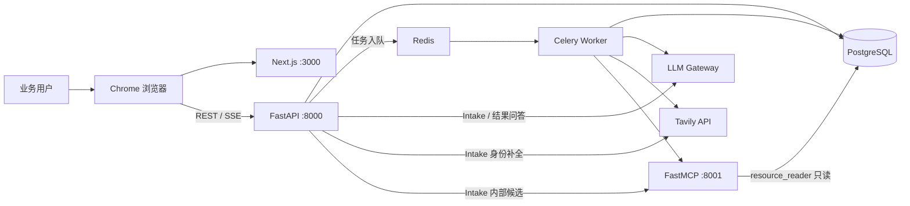
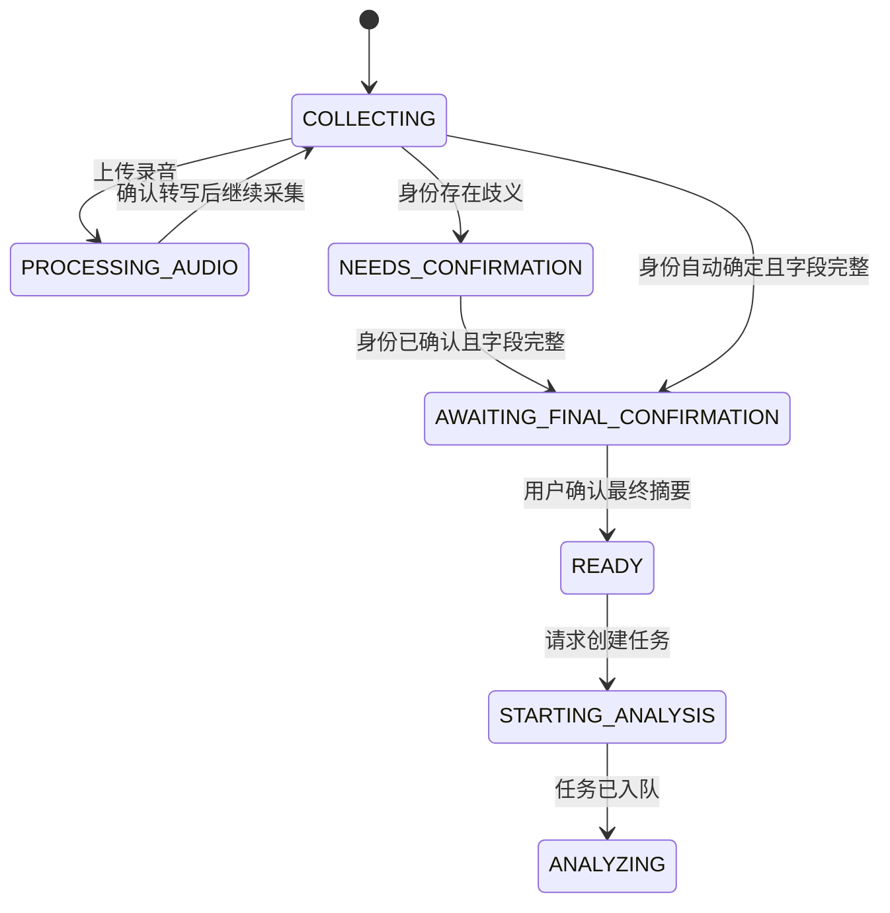
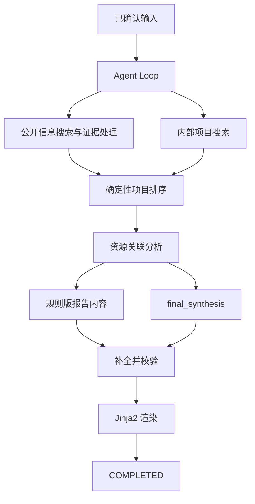

# 资源推动 Agent 当前代码说明

> 本文根据 2026-08-15 的当前工作区代码整理，用于开发接手、联调和评审。以代码实现为准；尚未实现的生产能力不作为现状描述。

## 1. 项目定位

本项目把一次会面、拜访或项目推动需求整理成可执行的研究任务。系统先通过多轮对话补全人物、企业、活动和关注方向，再结合公开网页、内部项目数据和结构化大模型生成两类结果：

- 详细报告：人物与企业背景、公开信息、相关项目、资源分析、风险和建议。
- 行动简报：会面目标、讨论话题、内部联系人、准备事项和风险提醒。

系统的关键设计不是让大模型直接调用外部资源，而是由 Python 代码控制查询参数、状态转换、证据校验、项目排序和降级策略。大模型只在受控节点内完成结构化理解、决策或内容综合。

## 2. 技术组成

| 层次 | 当前实现 | 主要职责 |
| --- | --- | --- |
| 前端 | Next.js 16、React 19、TypeScript | 信息采集、身份确认、进度展示、报告阅读和结果问答 |
| API | FastAPI、Pydantic | 会话与任务接口、参数校验、状态读取、SSE 事件输出 |
| 异步任务 | Celery、Redis | 音频转写和研究流水线 |
| 应用数据 | PostgreSQL 16、SQLAlchemy | Intake 会话、任务、调用日志和执行事件 |
| 内部检索 | FastMCP、只读数据库账号 | 身份候选、内部项目、项目详情和销售组合查询 |
| 公开检索 | Tavily | 网页搜索和正文提取 |
| 模型能力 | OpenAI 兼容网关、MiniMax-M3 | 结构化信息采集、动作选择、证据复核、报告综合和结果问答 |
| 音频 | faster-whisper | 本地录音转写 |
| 报告 | Jinja2 | Markdown 详细报告和行动简报渲染 |

## 3. 运行时架构



`docker-compose.yml` 定义 8 个服务：`postgres`、`redis`、`model-init`、`seed`、`mcp-server`、`backend`、`worker` 和 `frontend`。其中 `model-init` 与 `seed` 是一次性初始化服务。

持久化数据位于三个命名卷：

- `postgres_data`：数据库数据。
- `audio_data`：待转写录音及中间文件。
- `model_cache`：本地 Whisper 模型。

## 4. 核心业务流程

### 4.1 信息采集

文字入口是 `POST /api/v1/intake/chat`。`IntakeRunner` 的处理顺序如下：

1. 校验客户端消息是否基于当前会话版本，避免旧页面覆盖新对话。
2. 调用 `IntakeAgent` 提取结构化上下文；模型不可用时返回规则降级结果。
3. 用确定性完整性规则检查人物或企业、分析目标等必要字段。
4. 字段完整后先通过 MCP 查询内部身份候选。
5. 内部候选仍不能唯一确定时，才允许 Tavily 补全关键人身份。
6. 外部候选必须包含能够直接支持姓名及组织或职位关系的来源页证据。
7. 身份确定后生成最终摘要问题，用户确认摘要后会话才进入 `READY`。
8. `start-analysis` 固化输入快照，创建且仅创建一个研究任务。



`IntakeStructuredContext` 当前包含：

- 人物、人物职位与所属组织。
- 企业、项目、业务方向、关注问题。
- 活动类型、时间和地点。
- 实体标准化结果及其来源。
- 每个采集字段的完整状态。
- 最终摘要确认的版本和状态。

### 4.2 音频采集

录音入口只接受 `audio/webm`，单文件上限 30 MB。上传后创建 `IntakeAudioJob` 并由 Celery 调用本地 Whisper：

```text
QUEUED -> TRANSCRIBING -> NEEDS_REVIEW -> TRANSCRIBED
                         \-> FAILED -> QUEUED（重试）
```

转写结果必须由用户校对后作为一条普通消息重新进入 Intake 流程。成功使用后，原始 WebM 和中间 WAV 文件会被删除。

### 4.3 研究流水线

标准 Intake 路径会把已确认上下文保存到 `ResearchTask.confirmed_context`。兼容入口 `/api/v1/tasks/text` 和 `/api/v1/tasks/audio` 没有该前置步骤，因此 Pipeline 仍保留规则提取与任务级身份确认逻辑。

主流程如下：



Agent Loop 默认从 `PUBLIC_RESEARCH` 开始，最多 8 轮、4 次工具调用，并阻止连续重复动作。可选动作与阶段转换由代码白名单控制；模型返回非法动作时使用当前阶段的默认动作。

公开信息处理分为三路：规则可直接接受、规则可直接拒绝、需要模型复核。只有第三类交给 `evidence_verify`，最终保留的事实带有来源引用。

项目排序由 `ProjectRanker` 确定性完成，大模型不决定项目分数。`ResourceAssociationBuilder` 再根据已确认上下文、公开证据、项目结果和排序构造资源、风险、信息缺口及下一步建议。

### 4.4 报告后问答

任务完成后，`POST /api/v1/tasks/{task_id}/chat` 允许围绕当前任务结果继续提问。问答上下文来自已保存的确认信息、公开证据、项目结果和报告，不会重新执行完整研究流水线。清空接口只清理分析问答记录，不删除研究任务和报告。

## 5. 代码模块与职责

| 路径 | 职责 |
| --- | --- |
| `frontend/src/app/page.tsx` | 单页交互、轮询、SSE、录音、确认、报告和问答 |
| `backend/app/main.py` | FastAPI 应用、生命周期、CORS、路由注册 |
| `backend/app/api/intake.py` | Intake、音频、身份确认、摘要确认和开始分析接口 |
| `backend/app/api/tasks.py` | 兼容任务入口、任务查询、日志、SSE、取消和问答接口 |
| `backend/app/services/intake_runner.py` | Intake 一轮对话的状态编排 |
| `backend/app/services/intake_agent.py` | Intake 结构化 LLM 节点 |
| `backend/app/services/intake_completeness.py` | 必要字段完整性判断 |
| `backend/app/services/intake_entity_candidates.py` | 内部与外部身份候选、证据校验 |
| `backend/app/services/intake_activity.py` | 进程内 Intake 活动状态存储 |
| `backend/app/tasks/pipeline.py` | 研究任务总编排、取消检查和失败处理 |
| `backend/app/services/agent_loop.py` | 阶段、动作校验、循环限制和 Observation 聚合 |
| `backend/app/services/agent_tools.py` | Tavily 与 MCP 工具执行及结果标准化 |
| `backend/app/services/evidence_verify.py` | 公开证据规则分流与模型复核 |
| `backend/app/services/project_ranker.py` | 内部项目确定性评分与排序 |
| `backend/app/services/resource_association.py` | 项目、资源、风险和行动关联分析 |
| `backend/app/services/final_synthesis.py` | 最终综合输入构造与输出校验 |
| `backend/app/services/report_renderer.py` | Jinja2 报告渲染 |
| `backend/app/database.py` | 表初始化、轻量迁移和 Repository |
| `backend/app/models/database.py` | 应用状态 ORM 模型 |
| `mcp_server/server.py` | 四个内部只读 MCP 工具 |
| `mcp_server/project_repository.py` | 内部实体与项目数据库查询 |

建议的后端阅读顺序：`api/intake.py` -> `intake_runner.py` -> `api/tasks.py` -> `tasks/pipeline.py` -> `agent_loop.py` -> `agent_tools.py`。

## 6. LLM 节点与降级

当前提示词位于 `backend/prompts`，共 9 个结构化节点：

| 分组 | 节点 | 用途 |
| --- | --- | --- |
| Intake | `intake_chat` | 提取对话中的结构化上下文 |
| Intake | `intake_followup` | 根据工具观察决定追问方式 |
| Intake | `intake_identity_normalize` | 从有证据的外部页面标准化身份 |
| Intake | `intake_readiness` | 复核采集是否完整 |
| Intake | `intake_final_confirmation` | 生成最终摘要确认问题 |
| Research | `agent_turn` | 在受限动作集合中选择下一步 |
| Research | `evidence_verify` | 复核规则无法判定的证据 |
| Research | `final_synthesis` | 综合白名单材料形成报告内容 |
| Analysis | `analysis_chat` | 回答当前研究结果相关问题 |

模型网关不可用、超时、返回格式错误或输出未通过业务校验时，相关节点会记录失败或 `FALLBACK` 事件。能够降级的路径继续使用规则、Tavily、MCP 和 Jinja2；`ResearchTask.degraded_nodes` 保存发生过降级的节点名。

安全边界：

- LLM 不直接访问数据库、Tavily 或 MCP。
- Tavily 与 MCP 的实际参数由代码生成和校验。
- 外部身份候选必须有精确来源页证据，搜索摘要本身不足以确认身份。
- 最终综合只接收已确认和已校验的材料，输出还会再次经过结构校验。

## 7. API 清单

### 7.1 Intake API

基础路径：`/api/v1/intake`

| 方法 | 路径 | 用途 |
| --- | --- | --- |
| POST | `/chat` | 创建或继续 Intake 对话 |
| GET | `/{session_id}` | 读取会话、消息、确认请求和活动音频任务 |
| GET | `/{session_id}/activity` | 读取本轮活动阶段，供前端轮询 |
| POST | `/{session_id}/audio` | 上传 WebM 录音并创建转写任务 |
| GET | `/{session_id}/audio/{job_id}` | 查询转写状态 |
| POST | `/{session_id}/audio/{job_id}/retry` | 重试失败的转写 |
| POST | `/{session_id}/confirm` | 确认候选身份或提交手工标准名称 |
| POST | `/{session_id}/confirm-summary` | 按版本确认最终摘要 |
| POST | `/{session_id}/start-analysis` | 从 `READY` 会话幂等创建研究任务 |

身份确认和摘要确认都带版本校验。版本过期、会话状态不允许或重复修改时返回 `409`，客户端应刷新会话后再操作。

### 7.2 Task API

基础路径：`/api/v1/tasks`

| 方法 | 路径 | 用途 |
| --- | --- | --- |
| POST | `/text` | 兼容的纯文本任务入口 |
| POST | `/audio` | 兼容的音频任务入口 |
| GET | `/{task_id}` | 查询状态、证据、项目结果和报告 |
| GET | `/{task_id}/execution-log` | 分页读取持久化执行事件 |
| GET | `/{task_id}/events` | 以 SSE 输出执行事件 |
| POST | `/{task_id}/confirm` | 确认兼容入口产生的实体歧义 |
| POST | `/{task_id}/cancel` | 取消未结束任务 |
| POST | `/{task_id}/chat` | 围绕当前研究结果问答 |
| POST | `/{task_id}/clear` | 清空当前任务的分析问答 |

另有 `GET /health` 健康检查和 FastAPI 自动生成的 `/docs` 接口文档。

## 8. 数据模型

应用状态使用五张 ORM 表：

| 表 | 主要内容 |
| --- | --- |
| `intake_sessions` | 对话、结构化上下文、缺失字段、确认请求、版本和研究任务 ID |
| `intake_audio_jobs` | 音频路径、转写文本、校对文本、错误和重试次数 |
| `research_tasks` | 输入快照、研究中间结果、报告、状态和降级节点 |
| `llm_call_logs` | 节点、模型、耗时、Token、响应 ID 和错误 |
| `execution_events` | Intake 与研究任务的工具、阶段、动作、降级和错误事件 |

这些对象之间当前主要通过字符串 ID 逻辑关联，ORM 未声明数据库外键。会话消息、证据、项目匹配和报告内容主要保存在 JSON 或 Text 字段中。

内部业务表由 `seed/init.sql` 创建，核心包括客户、客户联系人、销售经理、销售代表、内部项目和项目状态历史。MCP Server 使用 `DATABASE_READONLY_URL` 查询它们，应用 LLM 不持有数据库访问能力。

## 9. 配置

配置入口为 `.env`，字段定义见 `backend/app/config.py`。最重要的配置分组如下：

| 分组 | 变量 |
| --- | --- |
| 数据与队列 | `DATABASE_URL`、`DATABASE_READONLY_URL`、`REDIS_URL` |
| 外部工具 | `MCP_SERVER_URL`、`TAVILY_API_KEY` |
| LLM | `OPENAI_API_KEY`、`OPENAI_BASE_URL`、`LLM_MODEL`、`LLM_REVIEW_MODEL`、`LLM_REASONING_EFFORT` |
| LLM 控制 | `LLM_ENABLED`、`LLM_TIMEOUT_SECONDS`、`LLM_MAX_RETRIES`、`LLM_SAFETY_SALT` |
| 阈值 | `LLM_WEB_IDENTITY_THRESHOLD`、`LLM_PROJECT_CONFIDENCE_THRESHOLD`、`LLM_ANALYSIS_CONFIDENCE_THRESHOLD` |
| 音频 | `AUDIO_DIR`、`WHISPER_MODEL_PATH` |
| 模板与提示词 | `PROMPT_DIR`、`DETAILED_REPORT_TEMPLATE`、`ACTION_BRIEF_TEMPLATE` |

代码还支持 `AGENT_MAX_LOOPS`、`AGENT_MAX_TOOL_CALLS`、`AGENT_MAX_REPEATED_ACTIONS`、`INTAKE_ENTITY_RESOLUTION_ENABLED`、`INTAKE_AUDIO_ENABLED` 和 `INTAKE_REACT_ENABLED`，即使 `.env.example` 未显式列出也可通过环境变量覆盖。

## 10. 启动与验证

按仓库约束，只从 canonical `main` worktree 启动 Compose，并固定项目名：

```powershell
docker compose -p resource-agent-demo up --build
```

不要在包含有效数据的环境使用 `down -v`。Dockerfile 使用 `COPY`，源码修改后需要重新构建受影响的应用服务。

服务地址：

- 前端：`http://localhost:3000`
- API：`http://localhost:8000`
- API 文档：`http://localhost:8000/docs`
- MCP：`http://localhost:8001/mcp`

本地验证命令：

```powershell
.\.venv\Scripts\python -m pytest backend\tests -q
Set-Location frontend
npm run build
```

后端修改应先运行对应的聚焦测试，再运行完整测试集。前端在 canonical worktree 使用普通生产构建；临时 worktree 才使用 `npm run build -- --webpack`。

## 11. 可观测性与排障

排障时优先按以下顺序查看：

1. `GET /api/v1/intake/{session_id}`：确认 Intake 状态、版本、缺失字段和确认请求。
2. `GET /api/v1/intake/{session_id}/activity`：确认当前是否在调用内部或联网工具。
3. `GET /api/v1/tasks/{task_id}`：确认任务状态、外部/内部查询状态、错误和降级节点。
4. `GET /api/v1/tasks/{task_id}/execution-log`：定位具体阶段、工具请求、工具响应、降级或异常。
5. `llm_call_logs`：检查具体模型节点的耗时、Token、格式错误或网关错误。
6. Compose 服务日志：区分 API、Worker、MCP、Redis 和数据库问题。

常见现象与定位：

| 现象 | 优先检查 |
| --- | --- |
| 一直要求补充信息 | `missing_information`、`field_states`、输入是否包含分析目标 |
| 一直停在身份确认 | `confirmation_request`、候选证据、确认版本是否过期 |
| 音频无法继续 | `IntakeAudioJob.status`、`error_message`、模型缓存和音频卷 |
| 任务没有进展 | Worker 是否存活、Redis 连接、任务状态和 execution log |
| 没有公开信息 | `TAVILY_API_KEY`、`web_search_status`、`web_fetch_status` |
| 没有内部项目 | MCP 健康、只读数据库连接、`internal_search_status` |
| 报告内容较保守 | `degraded_nodes`、公开证据是否被拒绝、内部项目是否命中 |

## 12. 当前边界

当前代码没有实现以下生产能力：

- 用户认证、授权和多租户隔离。
- Nginx 或 API Gateway、TLS、限流和统一入口。
- 独立报告服务、对象存储和报告版本管理。
- 集中的日志、指标和链路追踪平台。
- Intake activity 的跨进程持久化；它目前是 API 进程内存状态。
- 数据库级外键约束和完整的迁移框架。

因此，该仓库适合作为受控 Demo 和流程验证环境。若用于生产，首先应补齐身份权限、持久化迁移、集中可观测性、敏感信息治理和高可用部署。
